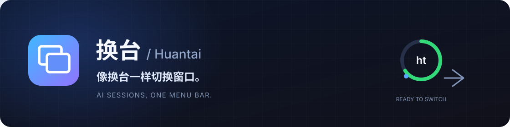
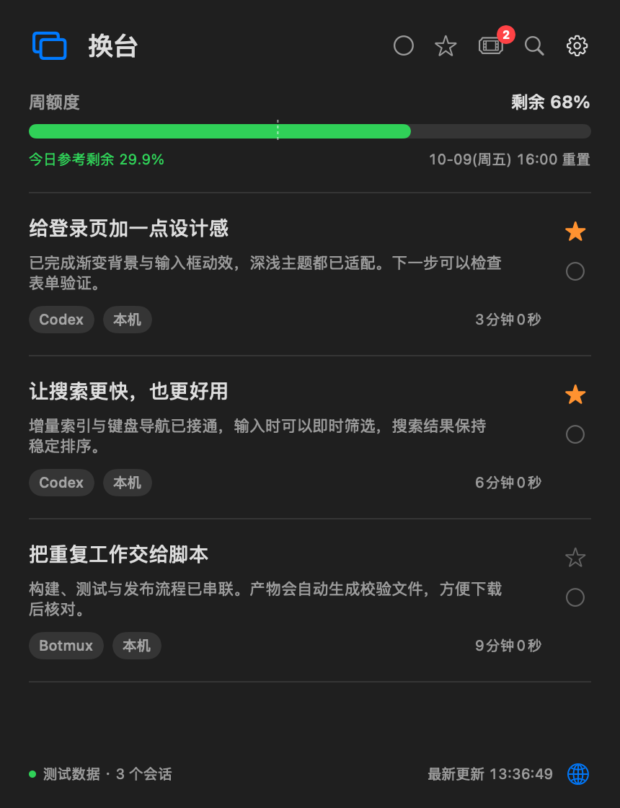
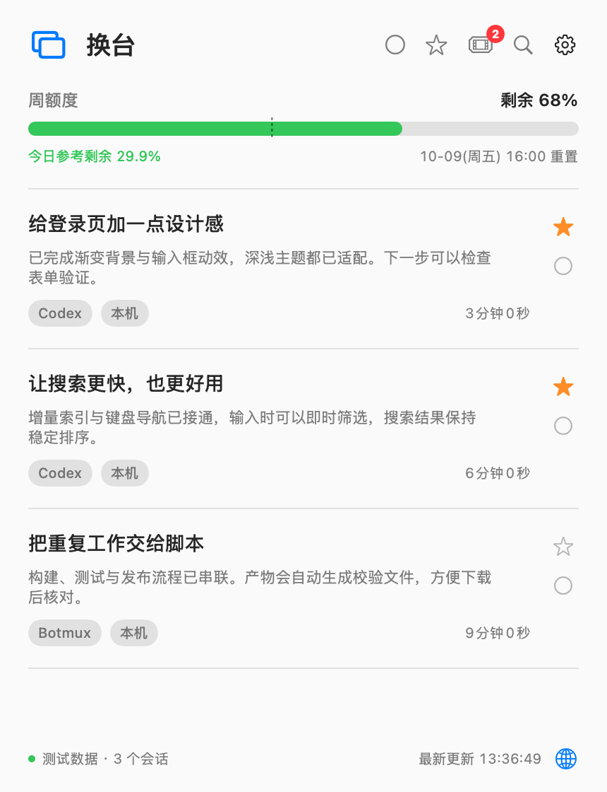
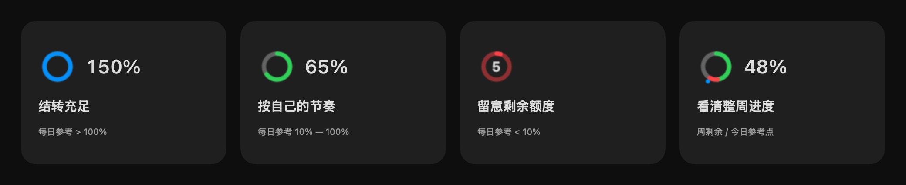
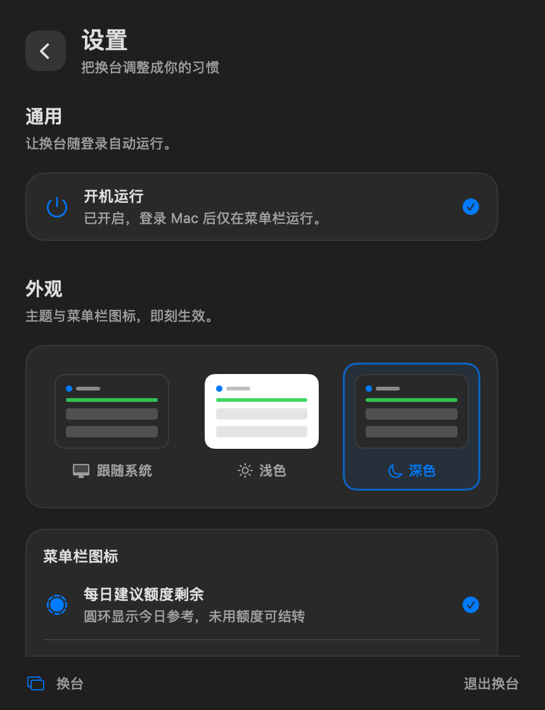
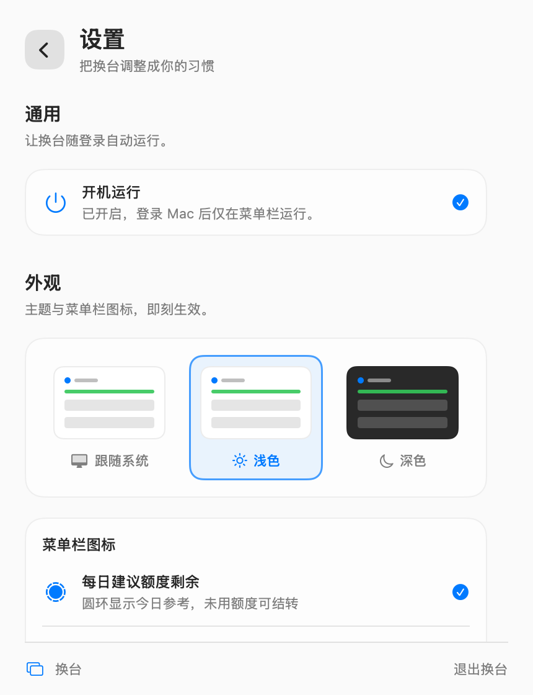

<div align="center">



**把散落的 AI 会话，收进 Mac 菜单栏。**

Codex / Botmux 会话管理 · 彩色额度圆环 · 全局快捷键 · 原生 SwiftUI


<br><br>

**[下载 Mac ARM64 版](https://github.com/Stxr/huantai/releases/latest)** &nbsp; · &nbsp; [使用指南](docs/public/usage.md) &nbsp; · &nbsp; [从源码构建](#从源码构建)

</div>

<br>

<table>
  <tr>
    <td align="center"><strong>深色，专注当前任务</strong></td>
    <td align="center"><strong>浅色，清晰一眼可见</strong></td>
  </tr>
  <tr>
    <td></td>
    <td></td>
  </tr>
</table>

<p align="center"><sub>截图由当前原生界面组件渲染，使用示例会话与额度；不含真实对话或账户数据。</sub></p>

## 一键换台，继续你的思路

写代码、做设计、跑脚本，几个 AI 会话常常同时进行。换台把它们放进同一个列表：最近回复排在前面，收藏留住重点，完成后继续下一项。

| | 换台能做什么 |
| --- | --- |
| 🪟 **会话聚合** | 汇总本机 Codex 与 Botmux 会话，点击标题直达对应的 Codex 或飞书会话。 |
| 💬 **回复预览** | 两行预览快速找回上下文，按 AI 最后一条可见回复的时间排序。 |
| ⌨️ **键盘导航** | 打开浮窗、上一个 / 下一个、历史后退 / 前进，常用动作都有全局快捷键。 |
| ⭐ **收藏与完成** | 收藏重要任务，默认隐藏已完成项；需要时随时查看与恢复。 |
| ◔ **额度一瞥** | 菜单栏圆环显示每日建议或每周剩余，颜色与参考点提示当前节奏。 |
| 🧩 **三个入口** | 原生 App、`ht` CLI、本机 Web 详情共用索引、收藏与完成状态。 |

切换会话后，屏幕角落的 Toast 显示当前位置，不抢焦点。在成功打开后的 **15 秒内**按 `⌘⇧D`，就能完成当前任务并进入下一项。鼠标点击收藏或完成只修改状态。

## 让额度变得直观



<p align="center"><sub>生产图标放大预览，数值为示例；数字始终保持系统文字色。</sub></p>

**每日建议**允许未用参考额度结转，数字可以超过 100%。圆环超过 100% 为蓝色，10% 至 100% 为绿色，低于 10% 为红色。

**每周剩余**用绿色显示余量，用红色标出超过当日参考的消耗，外侧圆点标示当日建议保留的位置。偏爱简洁，也可以切回原来的 Logo。

浮窗还会显示周重置时间、可用重置卡数量与逐张期限。额度来源提供的是百分比；每日建议是参考节奏，**不是官方日限额，也不是绝对 Token 剩余数**。

## 调成你的工作方式

<table>
  <tr>
    <td></td>
    <td></td>
  </tr>
</table>

一个连续滚动的设置页，集中调整登录启动、系统 / 浅色 / 深色主题、菜单栏图标与快捷键。开机运行和图标选项使用统一的勾选样式，选择后即刻生效。

| 默认快捷键 | 动作 |
| --- | --- |
| `⌘⌥,` | 打开 / 关闭浮窗 |
| `⌘⇧↑` / `⌘⇧↓` | 上一个 / 下一个会话 |
| `⌘⇧\` | 第一个会话 |
| `⌘⇧←` / `⌘⇧→` | 打开历史的后退 / 前进 |
| `⌘⇧D` | 成功打开会话后 15 秒内，完成并切换下一项 |

## 现在开始

支持 **Apple Silicon（ARM64）与 macOS 14 及以上**。

1. 从 [Releases](https://github.com/Stxr/huantai/releases/latest) 下载 `huantai-v0.1.0-macos-arm64.dmg`。
2. 打开 DMG，将「换台.app」拖入 Applications 并运行。
3. 点击菜单栏圆环，或按 `⌘⌥,` 开始换台。

本版采用临时签名，尚未进行 Apple Developer ID 签名和公证。会话读取需要本机 Codex 数据；额度读取需要已安装且已登录的 `codex` CLI。Botmux 关联和飞书跳转需要对应的本机数据与客户端，来源不可用时会显示具体状态。

### 终端也能换台

从同一 Release 下载 ARM64 CLI 压缩包，解压后运行 `ht --help`。

```bash
ht list                          # 最近的未完成会话
ht list --favorites --json       # 收藏列表，供脚本使用
ht query 搜索                    # 按标题或目录查找
ht open <会话ID或唯一前缀>         # 打开对应来源
ht complete <会话ID>              # 完成任务
ht reopen <会话ID>                # 恢复为未完成
ht usage refresh --json          # 刷新额度摘要
```

Web 详情随 App 运行，访问 `http://127.0.0.1:18784/`，查看筛选、连接状态与会话详情。

## 原生、轻巧，数据留在本机

Swift + AppKit + SwiftUI，没有第三方 Swift 包依赖，SQLite 使用系统库。

会话每 **5 秒**扫描，额度每 **5 分钟**更新。未变化日志复用缓存，追加日志增量读取；仅保留最后一条可见 AI 回复的短预览，最多 320 字符，不读取认证文件、不保存完整对话。Web 服务只监听 `127.0.0.1`。

默认状态目录为 `~/Library/Application Support/huantai`，可通过 `HUANTAI_HOME` 覆盖。开发启动脚本与 `bin/ht` 使用工程 `.local/state/`；App 会记住明确指定的目录，登录启动时继续复用。

## 从源码构建

需要 Mac ARM64、Swift 6 / Xcode 16 或更新工具链。

```bash
./scripts/build.sh
./scripts/run-demo.sh
./bin/ht list
```

<details>
<summary><strong>测试与 ARM64 打包</strong></summary>

```bash
./scripts/test.sh
xcrun swift-format lint --strict --recursive Package.swift Sources Tests
./scripts/release.sh v0.1.0
```

发布脚本只构建 ARM64，输出 DMG、CLI 压缩包与 SHA-256 校验文件到 `dist/`。运行数据、构建缓存、账户日志及内部审阅记录不进入仓库或发布包。

</details>

---

<div align="center">

[使用指南](docs/public/usage.md) · [开发与测试](docs/public/development.md) · [发布流程](docs/public/releasing.md) · [截图来源](docs/public/images/README.md)

<sub>本仓库暂未添加开源许可证。</sub>

</div>
