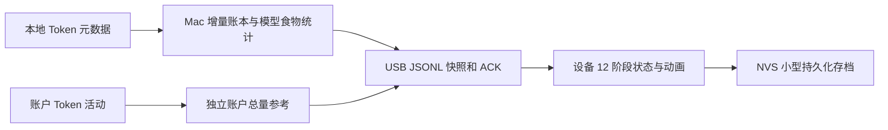

> 此文保留2026-10-06早期调研结论与当时方案；后续已实现宝可梦培养版，当前运行与验收见 [README](../README.md) 和 [实现文档](IMPLEMENTATION.md)。

# AI Passport 通信与 Token 宠物调研

调研日期：2026-10-06，用户时区 Asia/Shanghai。

## 结论

这块设备适合做 Token 宠物。建议先实现 **Mac 采集／记账 + USB 串口同步 + 设备本地画面与成长**。账户统计可读，但本地日志更适合实时显示“今天吃了什么模型”。无需让设备持有账户凭据或自行访问 AI 服务。

本轮只交付调研、脱敏证据和复查工具。尚未实现或烧录宠物固件，也未验证新协议的双向 ACK、屏幕显示和按键行为。用户已确认后续可以直接覆盖现有 CODO 固件，不必继续寻找其源码或兼容原协议。

## 一手资料与版本

| 资料 | 本轮核验版本 | 用途 |
| --- | --- | --- |
| [AI Passport main](https://github.com/FoloToy/ai-passport/tree/33d3d1d93a1125b356b47b6d83a7a60121be801e) | `33d3d1d93a1125b356b47b6d83a7a60121be801e` | BSP、硬件合同、无线演示与 USB 配置 |
| [Claude Buddy 参考](https://github.com/FoloToy/ai-passport/tree/9f5e2a43b7f8da9dda119174f0286ca8f2485795) | `9f5e2a43b7f8da9dda119174f0286ca8f2485795` | 完整 BLE 传输、JSON 行协议、累计／当日 Token |
| [Tamagezi 参考](https://github.com/FoloToy/ai-passport/tree/a4864752cca4d68ceca61ba3c73e39a473bc3031) | `a4864752cca4d68ceca61ba3c73e39a473bc3031` | 宠物状态、独立 UI、断电存档 |
| [官方 Codex App Server](https://learn.chatgpt.com/docs/app-server#7-token-usage-chatgpt) | 已安装 CLI `0.160.1` 的生成类型与真实调用 | `account/usage/read` 与字段边界 |
| 换台 `docs/usage-data-contract.md`、`CodexRateLimitsClient.swift` | 当前工作区源码 | 已有额度百分比读取，可复用短生命周期客户端方式 |

上游克隆及参考分支仅在临时目录只读调研；没有修改其源码、安装 ESP-IDF 或创建固件开发分支。正式固件开发时应先准备上游要求的五个 Passport 技能和 ESP-IDF 5.5.3，再从 `main` 建独立应用分支，保留 BSP 边界并设计自己的界面。

## 硬件识别结果

本轮 macOS IORegistry 明确给出：

- 厂商：Espressif。
- 设备：USB JTAG/serial debug unit。
- USB VID/PID：`303a:1001`。
- 已关联串口：`/dev/cu.usbmodem3101`；端口名在重新插拔后可能变化。
- 没有发现该串口被其他进程占用。
- 115200 参数下，6 秒被动监听收到 1126 字节，包含持续重复的 `CODO HELLO 1 240 320 97`／`98`。

**已证明**：系统识别到对应 USB 设备，串口可打开，当前运行固件能向 Mac 发送可识别文本。没有发送协议命令，没有显式请求复位，没有写入 Flash。

**未证明**：Mac→设备的应用命令、双向 ACK、真实画面、按钮、BLE 连接、Wi-Fi 联网，以及通过 ROM 查询独立核验芯片型号／Flash 容量。`303a:1001` 本身不能唯一证明芯片型号；`CODO HELLO` 各字段的含义未从固件源码核验，后面的 `97`／`98` 不解释成电量或 Token。

之后两次短时复查仍收到串口字节，但未捕获完整 `CODO HELLO`。首轮观察证明存在该输出，不能据此保证每次连接均收到它；新固件需要主动、可重试的握手协议。

`system_profiler SPUSBDataType` 此次给出了空数组，而 IORegistry 与 `/dev/cu.*` 均有设备，因此前者无结果不能认定硬件未连接。

上游定义的目标硬件为 ESP32-C3、8 MB Flash、无 PSRAM、240×320 ST7789 彩屏、UP/DOWN/OK 三键。资源设计应依据这些限制；这属于项目硬件合同，不能冒充本轮实测芯片与容量。

## 通信模式

| 通道 | 当前上游 main 实现 | 对宠物项目的意义 |
| --- | --- | --- |
| USB Serial/JTAG | 原生 USB，控制台和烧录；GPIO18/19 | 适合作为第一版 Mac↔设备通道；需要自己实现应用收包与响应 |
| Wi-Fi | 2.4 GHz STA 热点扫描 | main 没有联网、保存密码或业务 HTTP/MQTT；无线版本需增加连接与应用协议 |
| BLE | NimBLE 广播名 `FoloPassport`，`BLE_GAP_CONN_MODE_NON` | main 不可连接，不能直接写入 Token；需要参考完整 GATT 应用 |
| Bluetooth Classic | ESP32-C3 不支持 | 不能按传统蓝牙串口 SPP 设计 |
| NFC | 产品规格为被动 NTAG213 标签 | 无已核验的 MCU 双向实时数据通道，不用于持续 Token 同步 |

依据：[USB 配置](https://github.com/FoloToy/ai-passport/blob/33d3d1d93a1125b356b47b6d83a7a60121be801e/sdkconfig.defaults)、[BLE 广播](https://github.com/FoloToy/ai-passport/blob/33d3d1d93a1125b356b47b6d83a7a60121be801e/main/demo_ble.c)、[Wi-Fi 扫描](https://github.com/FoloToy/ai-passport/blob/33d3d1d93a1125b356b47b6d83a7a60121be801e/main/demo_wifi.c)、[产品规格](https://github.com/FoloToy/ai-passport/blob/33d3d1d93a1125b356b47b6d83a7a60121be801e/docs/hardware-design/specifications.md)。

USB 应使用 `usb_serial_jtag` 的应用读取任务，先正确安装驱动，协议响应与日志分开处理。不要改成默认 UART0：GPIO21 与背光冲突。参见上游 [串口协议经验](https://github.com/FoloToy/ai-passport/blob/33d3d1d93a1125b356b47b6d83a7a60121be801e/docs/reference/y2lin/serial-screenshot-protocol.md)。

### 可复用 BLE 参考

`demo/claude-buddy-port` 使用 Nordic UART Service：

| 特征 | UUID | 方向 |
| --- | --- | --- |
| Service | `6e400001-b5a3-f393-e0a9-e50e24dcca9e` | 服务 |
| RX | `6e400002-b5a3-f393-e0a9-e50e24dcca9e` | Mac 写入设备 |
| TX | `6e400003-b5a3-f393-e0a9-e50e24dcca9e` | 设备 Notify 给 Mac |

消息为 UTF-8 JSON，以换行结束；实现有分片、有界行缓冲、错误处理、连接生命周期与超时。参考协议已含 `tokens` 和 `tokens_today`。特征及 TX CCCD 需加密访问，使用 LE Secure Connections／passkey 配对，不能只拷贝 UUID 后忽略配对和通知订阅。

依据：[BLE 定义](https://github.com/FoloToy/ai-passport/blob/9f5e2a43b7f8da9dda119174f0286ca8f2485795/main/buddy_ble.h)、[协议解析](https://github.com/FoloToy/ai-passport/blob/9f5e2a43b7f8da9dda119174f0286ca8f2485795/main/buddy_protocol.c)、[设计](https://github.com/FoloToy/ai-passport/blob/9f5e2a43b7f8da9dda119174f0286ca8f2485795/docs/superpowers/specs/2026-08-11-claude-desktop-buddy-port-design.md)。这是可复用源码参考，本轮没有连接设备 BLE。

Wi-Fi 配网可参考 `demo/blufi-provisioning`：BLE 只负责 SSID／密码交换，应用数据走 Wi-Fi。它也不是 main 的现成功能。第一版用 USB 能减少网络栈和配网工作。

## Token 来源：真实可读范围

### 账户 Token 活动

本机 Codex CLI **0.160.1** 官方生成类型中存在 `account/usage/read`，真实只读调用成功，返回：

- `summary.lifetimeTokens`：非空累计 Token。
- `summary.peakDailyTokens` 及 streak 等摘要：非空。
- `dailyUsageBuckets[]`：非空，具有 `startDate`、`tokens`。

本轮最新每日桶是 **2026-10-05**，因此目前不能将账户桶当作 **10 月 6 日**的实时累计。接口的延迟、每日桶时区、跨产品／设备覆盖和模型拆分没有得到保证；缺失值应显示未知，不当成 0。

`account/rateLimits/read` 已在换台接入，实时读取也成功。但该接口的 `usedPercent` 是额度窗口百分比；不能按百分比换算 Token，也不能把重置后的百分比下降当作负摄入。账户 Token 活动和额度窗口需要分开显示。

账户统计不提供本轮已核验的逐模型食物明细。只使用账户数据时，“食物”应标成账户 Token，不能凭空编造模型或任务。

依据：[官方账户 Token 文档](https://learn.chatgpt.com/docs/app-server#7-token-usage-chatgpt)、本轮生成并保存的 [官方类型](../evidence/codex-0.160.1/)、只读探针实际结果。真实数值仅放于 `.local/`，不进入此文或 Wiki。

### 本地 Codex 文件

在 `sessions/` 和 `archived_sessions/` 发现 310 个 JSONL 文件，并核验最近 3 个样本；这些数量只是本次格式调查快照，不代表全量覆盖。样本均含：

```text
event_msg → payload.type == token_count
payload.info.total_token_usage
payload.info.last_token_usage
input_tokens / cached_input_tokens / cache_write_input_tokens
output_tokens / reasoning_output_tokens / total_tokens
turn_context → model
```

可以按模型给食物命名，按事件时间转换到 Asia/Shanghai 汇总今天。本轮只检查字段和样本，没有实现全量跨日账本。

需要注意的计数规则：

1. `total_token_usage` 是累计快照，不能把每个快照相加。重复快照不产生新摄入；累计值回退、日志替换或分叉需独立处理。
2. 已观察样本的 `total_tokens = input_tokens + output_tokens`。缓存输入是输入的子项，推理输出是输出的子项，不再次加进总量；`last_token_usage` 也不能无条件逐行求和。
3. 首次接入记录基线。宠物从领养开始增长；源头历史总量可单独显示，避免一导入旧日志就直达最高阶段。
4. 增量读取需保存文件身份、读取偏移、上个累计值、模型及幂等事件键；完整 JSON 行后才推进游标。通过亲子会话关系处理 fork/子 Agent，共享历史不重复记账。
5. 相邻快照跨过午夜且没有明确单次请求边界时，不能声称完全精确的自然日分摊；标注归属策略。缺失日志、轮转和其他设备也需显示覆盖范围。
6. 只摘取 Token／模型／时间元数据，不把提示词、回复正文、任务标题或账户凭据传给宠物。

本地计数是客户端观测值，不自动等同于服务端计费口径或账户全量。账户和本地应选择一个作为宠物成长的权威来源，另一来源仅作独立参考，不能直接相加。

## 拟定的宠物实现

以下属于**方案**，尚未实现。



设备主屏显示宠物、阶段 `n/12`、本阶段成长进度、今日摄入、累计摄入；食谱页按模型／来源展示“今天吃了什么”和各自 Token。UP/DOWN 切换主屏、食谱、成长记录，OK 查看明细；交互细节在实施时确定。

默认以已发生的 AI Token 使用作为喂食经验；动画、统计和进化本地运行。宠物累计摄入与账户历史累计分开，源数据缺失时保留最后状态并显示未同步。

建议的 12 个进化槽位：蛋、破壳、幼体、小型成长体、成长体、进阶体、成熟体、强化体、完全体、超进化体、究极体、最终形态。名称、12 套原创像素形象和阈值待正式设计；参考 Tamagezi 时注意它是 **12 种可选宠物、4 个成长阶段**，不是现成的 12 阶进化系统。只取存档／状态机经验。

成长阈值使用可配置、严格递增的 12 项累计 Token 门槛，按实际使用节奏校准。日期变化、额度重置、重连和重复数据均不降低阶段，也不重复触发进化动画。

### 新 USB 协议草案

协议是宠物项目的新设计，**不是当前 CODO 命令**。115200、8N1、UTF-8 JSONL；消息种类包括 `hello`、`snapshot`、`ack`、`error`。例如：

```json
{"v":1,"type":"snapshot","epoch":"demo-adoption","seq":42,"date":"2026-10-06","timezone":"Asia/Shanghai","source":"codex-local","tokens_today":"123456","pet_tokens_total":"2345678","stage":3,"food":[{"model":"example-model","tokens":"123456"}]}
```

示例数值均为虚构。Token 用十进制字符串传输，设备严格解析到 `uint64_t`，避免 32 位溢出和 JSON 浮点精度问题。消息上限建议 2048 字节，food 项数及文本长度有界；协议实现时需验证完整 JSON 行、碎片、超长输入和未知版本。

Mac 保存权威账本，设备接受同一 `epoch` 的更新 `seq`，返回对应 ACK。重发相同快照只回 ACK，不增加 Token；同一 epoch 计数倒退拒绝，换 epoch 需明确的领养／来源切换过程。设备保存小型最新快照，断电后可显示；重连由主机完整快照校准。NVS 使用版本、CRC／双槽和限频写入，不能每次心跳写 Flash。

设备使用小块 LVGL 刷新和小尺寸像素素材；无 PSRAM 下不堆多帧全屏图片。中文 UI 需专用字形子集，不能依赖默认 Montserrat。串口接收、NVS 和声音使用工作任务；网络／通信回调不能直接操作 LVGL。

## 后续验收范围

- 主机：重复／追加／半条 JSON／计数回退／文件替换／fork／跨日／断线／来源切换的去重与账本测试。
- 协议：真实设备 hello→snapshot→ACK，重发不加餐，超长和非法消息不崩溃。
- 设备：三键页面、12 阶形象与进化、中文数字、断电存档、重连补同步及内存占用。
- 固件：上游静态与 host gate、ESP-IDF 5.5.3 构建、8 MB 分区与 merged image 校验。

本轮状态：硬件枚举 **PASS**；现有固件设备→Mac 串口观察 **PASS**；账户 Token 读取 **PASS**；本地元数据样本 **PASS**。宠物固件 Build **NOT RUN**；新固件 Host tests **NOT RUN**；新固件 Device tests **NOT RUN**。不存在可供烧录的宠物二进制。
